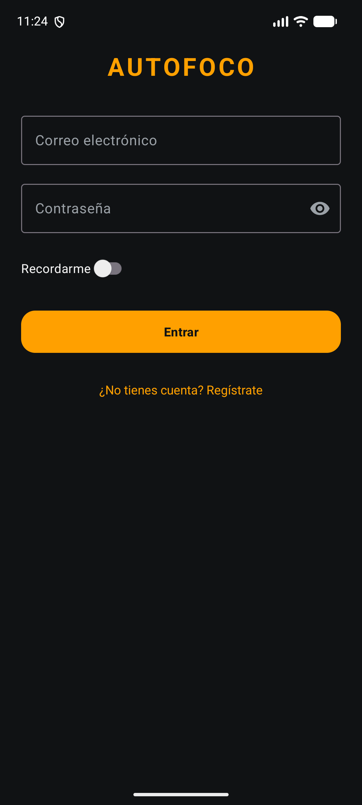
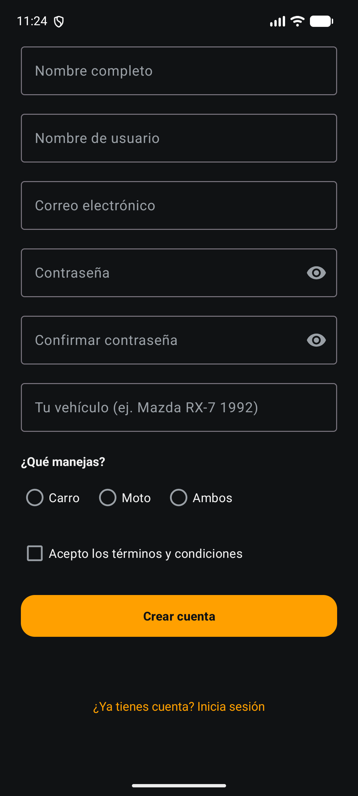
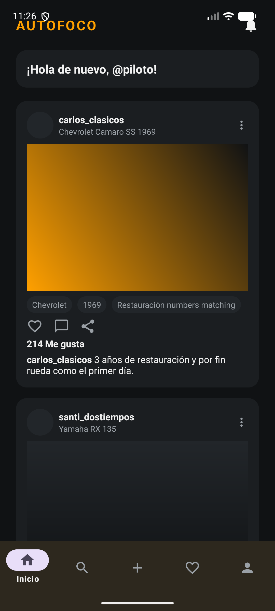
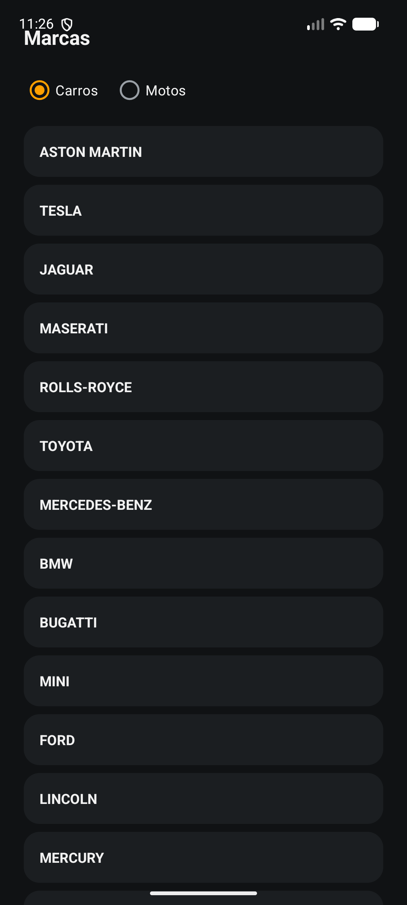
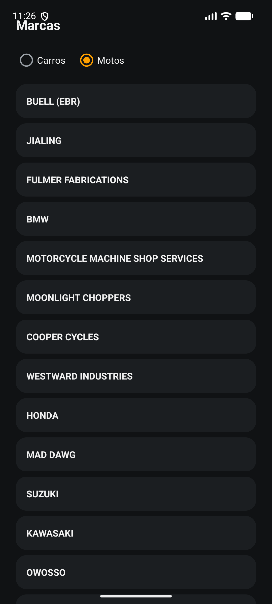

# Autofoco

Red social de fotografía de vehículos (carros y motos), desarrollada como taller
de la materia Dispositivos Móviles, Universidad Surcolombiana.

## Integrantes

- **Juan David Fierro Calderón** — estudiante de sexto semestre de Ingeniería de
  Software, Universidad Surcolombiana.
- **Luis Samuel Toconas Parra** — estudiante de sexto semestre de Ingeniería de
  Software, Universidad Surcolombiana. ([GitHub](https://github.com/Sam-9606))

## Qué es

App nativa de Android que simula una red social enfocada en fotografía
automotriz: los usuarios suben fotos de su carro o moto, encuentros,
restauraciones y detalles de motor o rines. Los patrones de interacción están
inspirados en Instagram, pero con marca e identidad visual propias.

## Stack técnico

- Kotlin
- Layouts XML + Views (sin Jetpack Compose)
- ViewBinding
- Material Components para Android
- `ConstraintLayout` como raíz de cada pantalla, `LinearLayout` para agrupaciones internas
- Navegación con `Activity` + `Intent` explícito
- `RecyclerView` para el feed y para el listado de marcas
- Room para persistencia local (tabla de marcas)
- Retrofit + Gson para consumir la API pública de NHTSA vPIC
- `lifecycle-runtime-ktx` (`lifecycleScope`) para las corrutinas de red/base de datos
- `SharedPreferences` para recordar el tipo de vehículo consultado

## Estructura del proyecto

```
app/src/main/
├── java/com/usco/autofoco/
│   ├── LoginActivity.kt
│   ├── RegistroActivity.kt
│   ├── PrincipalActivity.kt
│   ├── MarcasActivity.kt       // pantalla de marcas (Retrofit + Room, Offline-First)
│   ├── Extras.kt               // claves de los putExtra y de SharedPreferences
│   ├── Validaciones.kt         // funciones puras de validación de formularios
│   ├── model/
│   │   └── PublicacionModel.kt // data class de una publicación del feed
│   ├── adapter/
│   │   ├── PublicacionAdapter.kt // adapter del RecyclerView del feed
│   │   └── MarcaAdapter.kt       // adapter del RecyclerView de marcas
│   ├── dto/
│   │   ├── MakeDto.kt            // marca tal como la devuelve la API de vPIC
│   │   └── VpicResponseDto.kt    // respuesta completa de vPIC
│   ├── api/
│   │   ├── VpicApiService.kt     // interfaz Retrofit del endpoint de marcas
│   │   └── RetrofitClient.kt     // singleton de Retrofit
│   └── db/
│       ├── MarcaEntity.kt        // tabla local "marcas"
│       ├── MarcaDao.kt           // consultas de la tabla de marcas
│       └── AutofocoDatabase.kt   // base de datos Room (singleton)
└── res/
    ├── layout/                 // activity_login, activity_registro, activity_principal,
    │                           // activity_marcas, item_publicacion, item_marca
    ├── values/                 // colors, dimens, strings, themes
    ├── drawable/                // formas base, íconos y placeholders de fotos del feed
    └── menu/                    // menú de la bottom navigation
```

La app sigue sin Fragments, ViewModel, Hilt ni Navigation Component, pero ya no es
un único paquete plano: cada capa (modelo, adapter, red, persistencia) vive en su
propia carpeta a medida que el proyecto lo pidió.

## Laboratorio de Datos

La pestaña "Buscar" de la barra inferior abre la pantalla de **Marcas**, que
consulta la API pública [NHTSA vPIC](https://vpic.nhtsa.dot.gov/api/) (no
requiere API key) para traer las marcas de vehículos registradas en Estados
Unidos, filtradas por tipo (carros o motos).

La estrategia es **Offline-First**: al entrar a la pantalla (o al cambiar el
tipo de vehículo), la app intenta traer las marcas por Retrofit y las guarda en
una tabla local de Room; si la consulta falla por falta de red, se muestra lo
último que quedó guardado en esa tabla en vez de dejar la pantalla vacía. El
tipo de vehículo elegido (Carros/Motos) se recuerda entre sesiones con
`SharedPreferences`.

## Cómo ejecutar

1. Clonar el repositorio.
2. Abrirlo en Android Studio y esperar a que termine el sync de Gradle.
3. Ejecutar en un emulador o dispositivo físico con API 24 o superior.

No necesita configuración adicional ni claves de API. Sí necesita conexión a
internet para la primera consulta de marcas de cada tipo (carros/motos); el
resto de la app funciona igual sin conexión.

## Cómo probar

No hay backend propio para cuentas de usuario, así que el login y el registro
solo validan el formato de los datos, no verifican contra una cuenta que ya
exista:

- **Login:** cualquier correo con formato válido (ej. `piloto@autofoco.com`) y
  una contraseña de 6 caracteres o más. El switch "Recordarme" se refleja luego
  en la pantalla principal.
- **Registro:** completa todos los campos, escribe la misma contraseña dos
  veces, elige qué manejas (Carro, Moto o Ambos) y acepta los términos.

Ambos flujos navegan a la pantalla principal, que muestra los datos recibidos
por `Intent` (nombre o usuario, vehículo, si la sesión quedó recordada, etc.) y
un feed de 6 publicaciones de ejemplo con el corazón de "me gusta" funcional.
Desde la pantalla principal, solo la pestaña "Inicio" (feed) y "Buscar"
(marcas) de la barra inferior están activas; las demás muestran un aviso de
que estarán disponibles próximamente.

Para probar el Laboratorio de Datos: entra a "Buscar" con conexión a internet
y espera a que cargue el listado de marcas (arranca en "Carros" por defecto).
Cambia el toggle a "Motos" y confirma que el listado se reemplaza. Cierra y
vuelve a abrir la app: la pestaña recordará el último tipo elegido. Si
desactivas la conexión del dispositivo y vuelves a entrar, la pantalla sigue
mostrando el último listado consultado, leído desde la base de datos local.

## Capturas

| Login | Registro | Feed |
|---|---|---|
|  |  |  |

| Marcas · Carros | Marcas · Motos |
|---|---|
|  |  |

## Flujo de navegación

```
LoginActivity  --Intent-->  PrincipalActivity  --Intent-->  MarcasActivity
      |                           (tab "Buscar")
      '--Intent-->  RegistroActivity  --Intent-->  PrincipalActivity
```

Al llegar a `PrincipalActivity` desde cualquiera de los dos caminos se llama a
`finish()` en la pantalla de origen, así que el botón atrás no regresa al login
ni al registro. `MarcasActivity` sí se puede cerrar con el botón atrás para
volver al feed, porque `PrincipalActivity` no se cierra al abrirla.
